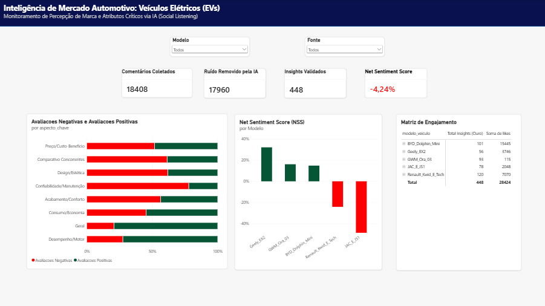
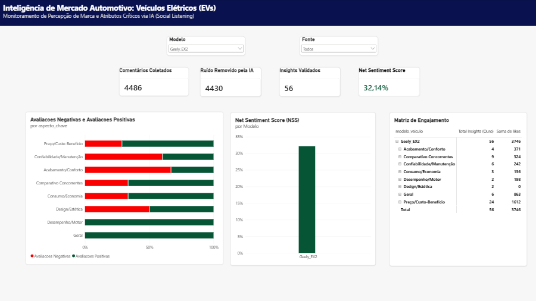
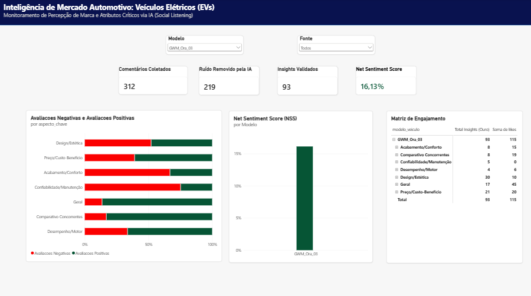
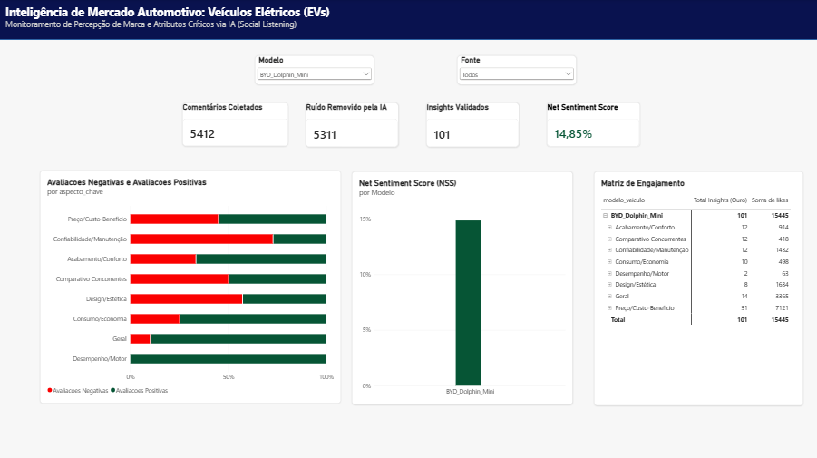
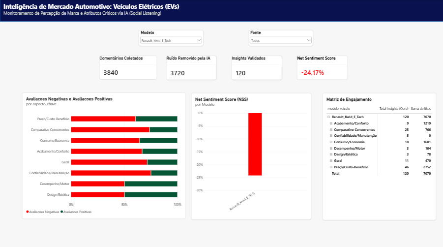
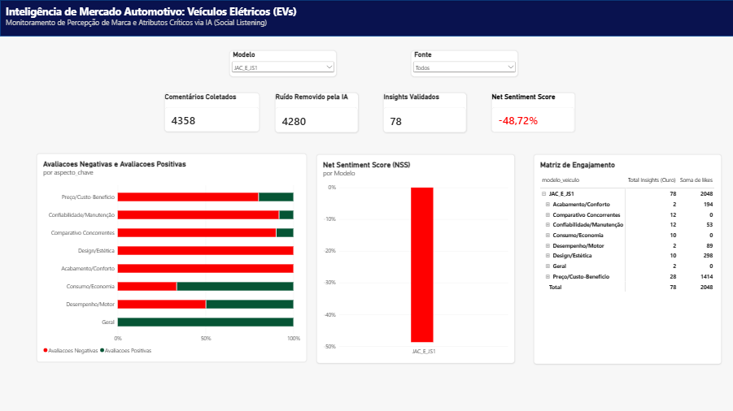

# 🚗 EV Social Listening BR: Análise de Sentimento do Mercado Automotivo

## 📌 Visão Geral do Projeto
Este projeto é uma Prova de Conceito (PoC) de **Inteligência de Mercado** focada no setor de Veículos Elétricos (EVs) no Brasil, com escopo delimitado especificamente para os **modelos elétricos de entrada (sub-R$ 150 mil) e seus concorrentes diretos**. O objetivo é transformar dados não estruturados de redes sociais em *insights* acionáveis para montadoras e concessionárias, identificando exatamente quais aspectos (Preço, Acabamento, Desempenho, Consumo, Design, Manutenção, Comparativo aos concorrentes e Sentimento geral) são mais elogiados ou criticados pelos consumidores frente ao mercado.

## 🏗️ Arquitetura da Solução
O pipeline de dados foi desenhado com foco em eficiência de custos e escalabilidade:

1. **Extração:** Coleta de comentários de reviews automotivos via API do YouTube (com limiar de engajamento para otimização de requisições) e Web Scraping do Reddit via Apify.
2. **Processamento com IA:** Utilização do modelo `gemini-3.5-flash-lite` orquestrado pelo LangChain para classificar o sentimento e o aspecto chave de cada comentário com valor comercial.
3. **Armazenamento e Data Quality:** Consolidação da camada Ouro em um banco de dados relacional (Supabase/PostgreSQL), onde consultas SQL são utilizadas para verificação e validação da qualidade dos dados.
4. **Visualização:** Conexão direta via ODBC com o Microsoft Power BI para modelagem em esquema *Star Schema* via DAX e criação de dashboards gerenciais.

## ⚙️ Metodologia e O Pipeline de Dados

Para garantir a qualidade analítica e evitar vieses estatísticos, regras estritas foram aplicadas à ingestão de dados em módulos Python independentes:

* **Estratégia de Coleta (`extract_youtube.py` e Apify):** Extração dos vídeos mais relevantes de 5 modelos de EVs no YouTube, focando estritamente em comentários principais com $\ge$ 50 curtidas. O Reddit foi incorporado via Apify (filtro de $\ge$ 1 curtida) após restrições da API oficial, garantindo alta pertinência técnica de fóruns.
* **Filtros e Rate Limits (`preprocess_comments_yt.py` e `preprocess_comments_reddit.py`):** Validação rigorosa via IA para garantir que o texto possuísse valor comercial e fizesse referência explícita ao carro alvo, categorizando os resultados em 8 aspectos automotivos.
* **Governança (`consolidar_dados.py` e `upload_supabase.py`):** Concatenação forçando a integridade do esquema, injeção de metadados da fonte e sobrescrita de tabelas fato no PostgreSQL.

## ⚠️ Aviso Legal e Escopo Analítico (Disclaimer)

Para garantir a total transparência metodológica e evitar correlações errôneas, este projeto é regido pelas seguintes premissas:

* **Natureza do Projeto:** Esta é uma Prova de Conceito (PoC) independente, desenvolvida estritamente para fins de pesquisa em Engenharia de Dados, aplicação de LLMs (Inteligência Artificial) e composição de portfólio profissional. Não há qualquer afiliação, patrocínio ou vínculo com as montadoras citadas.
* **Percepção vs. Conversão (O Limite do Dado):** O *Net Sentiment Score (NSS)* e as volumetrias aqui apresentadas refletem exclusivamente a **reputação digital e o *Share of Voice*** do recorte analisado. Estes indicadores não devem ser utilizados como *proxy* ou justificativa direta para estimar volumes de vendas, emplacamentos oficiais ou sucesso comercial de nenhum dos veículos.
* **Auditoria Qualitativa (Human-in-the-Loop):** Como o julgamento de LLMs é probabilístico, realizou-se uma amostragem auditada manualmente (50 registros da camada Gold). O modelo obteve uma **precisão de 82%**. Os Falsos Positivos retidos concentraram-se majoritariamente na categoria de sentimento **NEUTRO**, o que atenua o impacto no cálculo do NSS e mantém a polaridade comparativa protegida contra distorções.
* **Gestão de Viabilidade (Exclusão do Instagram):** Testes na fase de Extração revelaram forte bloqueio anti-scraping (limite de paginação) no Instagram. Para evitar arquiteturas frágeis, risco de banimento de contas (*shadowban*) e mitigar o viés de obsolescência temporal de postagens antigas (*Data Decay*), a plataforma foi intencionalmente removida do escopo.

## 📊 Resultados do Funil de IA e Ponderação de Fontes

A hipótese de que o comportamento do usuário afeta a densidade do dado foi comprovada na conversão do funil:

* **YouTube (Escala de Consenso):** A taxa de utilidade oscilou entre 0,4% e 0,6%, evidenciando a alta dispersão temática da plataforma. Contudo, a exigência de $\ge$ 50 curtidas atuou como um multiplicador: os poucos comentários mantidos representam o consenso direto de dezenas ou centenas de consumidores que interagiram com a mensagem.
* **Reddit (Alta Profundidade):** A taxa de retenção variou de 17% a 51,7%, confirmando que os fóruns entregam altíssima densidade de inteligência comercial por texto. O anonimato reduz a pressão, favorecendo o detalhamento técnico e a validação por pares.

## 📈 Resultados de Negócio e Conclusões

A aplicação do pipeline de IA revelou um panorama claro e estruturado sobre a aceitação dos veículos elétricos (EVs) no Brasil. O processamento reduziu **18.408** comentários brutos a **448** *insights* de alto valor (representando **28.424 interações/likes**), provando a inviabilidade da análise manual e o altíssimo ROI da Inteligência Artificial em *Social Listening*.

Os dados consolidados no painel revelam o comportamento do consumidor em três eixos principais:

### 1. O Abismo Competitivo: Vencedores vs. Perdedores
O comparativo de *Net Sentiment Score (NSS)* divide o mercado brasileiro em duas eras distintas:
* **A Nova Geração (Vencedores):** Modelos asiáticos recentes como **Geely EX2 (+32,14%)**, **GWM Ora 03 (+16,13%)** e **BYD Dolphin Mini (+14,85%)** formam o pelotão de elite com percepção de valor positiva.
* **A Velha Guarda (Perdedores):** Projetos mais antigos ou adaptados, como **Renault Kwid E-Tech (-24,17%)** e **JAC E-JS1 (-48,72%)**, sofrem rejeição severa, sendo percebidos como obsoletos ou caros frente às inovações da concorrência.

### 2. Dores e Trunfos Universais do Mercado
Ao cruzar a polaridade (Positivo/Negativo) pelos aspectos automotivos predefinidos, identificou-se um padrão comum a todas as marcas:
* 🚨 **A Dor Universal (Confiabilidade/Manutenção):** Este é o maior gargalo do setor. Mesmo em modelos bem avaliados, o consumidor brasileiro expressa forte ceticismo e medo quanto ao **pós-venda, disponibilidade de peças e durabilidade** de marcas estreantes.
* ⭐ **O Trunfo (Desempenho e Geral):** Aspectos ligados à motorização (torque instantâneo) e à experiência geral com a dirigibilidade do EV são majoritariamente positivos, indicando que **a principal barreira de adoção do público é mercadológica (medo, preço), e não técnica (a dirigibilidade do EV)**.

### 3. Diagnóstico Micro (Performance por Modelo)

<b>🟢 Geely EX2 (Destaque em Desempenho e Satisfação) | NSS: +32,14%</b>

 
Lidera o ranking de reputação. Seus pontos fortes são o <i>Desempenho/Motor</i> e a satisfação <i>Geral</i>, que conseguiram anular sua principal crítica identificada: o <i>Acabamento/Conforto</i>.
  

<b>🟢 GWM Ora 03 (O Polarizador) | NSS: +16,13%</b>

 
O aspecto dominante nas discussões é o <i>Design/Estética</i>, com uma divisão acirrada de sentimentos (quase 50/50). Os dados refletem um carro de nicho e personalidade visual forte, focado em um público específico.
  

<b>🟢 BYD Dolphin Mini (O Campeão de Engajamento) | NSS: +14,85%</b>

 
Com mais de 15 mil <i>likes</i> validados, domina o <i>Share of Voice</i>. O principal motivador de engajamento é o <i>Preço/Custo-Benefício</i>, majoritariamente positivo. A estratégia agressiva de precificação refletiu positivamente na percepção do público digital.
  

<b>🔴 Renault Kwid E-Tech (A Queda do Pioneiro) | NSS: -24,17%</b>

 
Além de sofrer nos comparativos diretos, apresenta forte rejeição no quesito <i>Consumo/Economia</i>. A autonomia e a entrega real do veículo frustram as expectativas quando comparadas aos novos padrões das marcas asiáticas.
  

<b>🔴 JAC E-JS1 (Rejeição Total) | NSS: -48,72%</b>

 
Amarga o pior NSS da base. O modelo foi massivamente rejeitado em <i>Design</i> e <i>Acabamento</i> (100% negativos na amostragem retida).
  

 

### 🧮 A Matemática do Negócio: Como o Net Sentiment Score (NSS) é Calculado?

O **Net Sentiment Score (NSS)** é a métrica de central deste painel, adaptada da lógica do NPS (*Net Promoter Score*) para o contexto de *Social Listening*. Ele consolida a percepção de mercado em um único indicador direcional, utilizando a seguinte fórmula matemática:

$$NSS = \left( \frac{\text{Avaliações Positivas} - \text{Avaliações Negativas}}{\text{Total de Avaliações Validadas}} \right) \times 100$$

**Como interpretar a engenharia da métrica:**
* **O Papel da Neutralidade:** Comentários classificados como "Neutros" não somam ao numerador, mas compõem o denominador (*Total*). Estrategicamente, isso significa que um alto volume de opiniões ambíguas ou neutras atua como um "diluidor", puxando o NSS em direção a 0%, mas **nunca inverte a polaridade real da marca** (de positivo para negativo).
* **Escala de Avaliação:** Um NSS $> 0\%$ indica que o volume de defensores do produto supera os detratores. O Geely EX2, com $+32\%$, demonstra uma tração comercial excelente, enquanto os $-48\%$ do JAC E-JS1 configuram um cenário de rejeição crítica.

### 🎯 Conclusão Estratégica (Actionable Insight)
Os dados comprovam que a nova geração de EVs chineses elevou o padrão de exigência no Brasil, punindo modelos defasados. 
Para as montadoras líderes (BYD, GWM e Geely) consolidarem o domínio, o investimento primário em marketing e operações não deve ser no produto em si, mas em campanhas agressivas de desmistificação de **Garantia, Pós-Venda e Disponibilidade de Peças**, quebrando a última grande objeção (Confiabilidade) apontada pelos dados.
